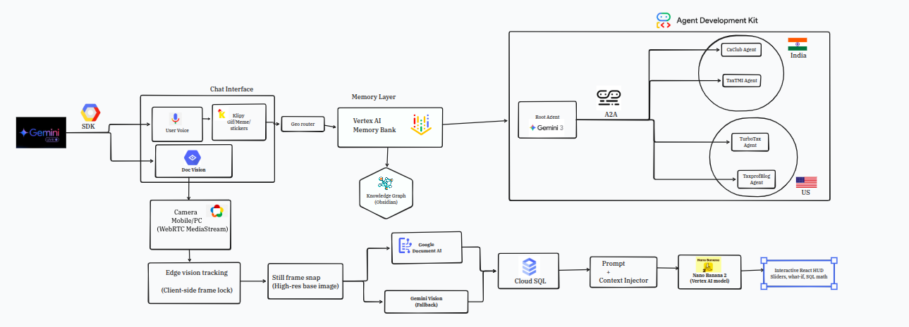

# Saul Goodman AI

Saul Goodman AI is a Gemini Live powered, multi agent tax advisor for India, the US, and cross border scenarios. It connects live voice and vision, evidence gathering, and long term memory so users can speak naturally and receive cited guidance with a knowledge graph that evolves over time.

This README is aligned to the current codebase under `Taxclarity/` and the system diagram in `Architecture.png`.

## Quick Start

1. Install uv and create a virtual environment.
2. Install backend dependencies.
3. Start the backend services.
4. Start the frontend.

```bash
cd Taxclarity
uv venv
source .venv/bin/activate
uv pip install -r requirements.txt
./run.sh
```

In another terminal:

```bash
cd Taxclarity/frontend
npm install
npm run dev
```

Open `http://localhost:3000`.

## Architecture Overview



The flow is:

1. Gemini Live handles real time voice and response streaming.
2. The WebSocket server coordinates the session and A2A tool calls.
3. The Root Agent dispatches to regional agents in India and the US.
4. Vertex AI Memory Bank provides long term context.
5. The Knowledge Graph updates from every turn.
6. Optional document extraction uses Google Document AI with a Gemini Vision fallback.

## What You Can Do

1. Speak or type tax questions and receive cited responses.
2. See live agent responses and sources in the right panel.
3. Watch the knowledge graph grow as the conversation progresses.
4. Use camera input for document or context awareness.

## Related Repository for Document Vision

The document vision pipeline lives in a separate repository:

```
https://github.com/LE-TAPU-KOKO/Saul
```

## Project Structure

Active runtime code lives under `Taxclarity/`.

1. `Taxclarity/backend` contains the WebSocket server, graph API, session state, memory bridge, and orchestration.
2. `Taxclarity/agents` contains the Root Agent and A2A sub agents for evidence sources.
3. `Taxclarity/memory` contains the Vertex memory bank adapter and extractors.
4. `Taxclarity/frontend` contains the Next.js UI used in production.
5. `Taxclarity/docs` contains deployment notes and operations guides.

## Environment Setup

Create a `.env` in `Taxclarity/`.

Required values:

1. `GOOGLE_API_KEY` for Gemini Live and Vertex AI Memory Bank
2. `ROOT_AGENT_URL` default `http://localhost:8000`
3. `GRAPH_API_URL` default `http://localhost:8006`
4. `VOICE_MODEL` for Gemini Live audio model

Memory settings:

1. `MEMORY_PROVIDER` set to `vertex`
2. `USE_VERTEX_MEMORY` set to `true`
3. `USE_CLOUD_SQL_MEMORY` set to `false`

## Running Locally

Start backend services:

```bash
cd Taxclarity
./run.sh
```

This starts:

1. Root Agent on `8000`
2. CAClubIndia agent on `8001`
3. TaxTMI agent on `8002`
4. WebSocket server on `8003`
5. TaxProfBlog agent on `8004`
6. TurboTax agent on `8005`
7. Graph API on `8006`

Start the frontend:

```bash
cd Taxclarity/frontend
npm run dev
```

Open `http://localhost:3000`.

## Knowledge Graph

1. The left panel renders a live knowledge graph.
2. Nodes and relationships update on each turn.
3. Data is stored in Obsidian format under `Taxclarity/data/obsidian_vault`.
4. The Graph API serves nodes to the frontend.

## Memory System

Long term memory is handled by Vertex AI Memory Bank.

1. The memory service loads prior summaries and topics at session start.
2. The Root Agent injects that memory into the system prompt.
3. The graph is enriched from both user and agent turns.

## Evidence and Citations

1. Each agent returns structured evidence items.
2. The Root Agent synthesizes a single response with citations.
3. The UI renders sources and links in the right panel.

## Deployment

This repository supports Vercel for frontend and a Google Cloud VM for backend.

1. Vercel builds from `Taxclarity/frontend`.
2. Backend runs on a VM with systemd and Nginx.
3. WebSocket endpoint is exposed over TLS using Nginx.

See `Taxclarity/docs/deployment-vercel-gce.md` for operational steps.

Automated backend deployment is configured in:

```
.github/workflows/deploy-backend-vm.yml
```

## License

Internal project for the Gemini Live Agent Challenge.
